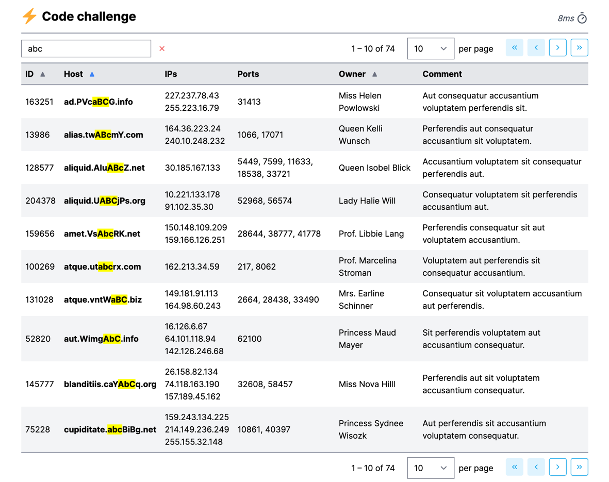

# Performance Test for Frontend and Backend Integration

## Objective

The goal of this test is to load and display a list of network assets in a performant and efficient manner. Each asset should be displayed in its own component, showcasing all fields in a manner that is both aesthetically pleasing and easy to navigate. A **search functionality** should be implemented to filter the results based on the "host" column.

Candidates are encouraged to improve both the **Go backend** and the **Next.js frontend** to achieve optimal performance and usability. **Efficiency and speed** are key, and we expect you to identify, fix, and document any performance bottlenecks you find.

### Requirements

1. **Performance Optimization**:
    - The app should handle large datasets efficiently. The backend must be optimized for fast API responses, and the frontend should render the data without unnecessary delays.

2. **Signature Calculation**:
    - The signature generation functionality **must be preserved**. Each asset, along with its associated ports and IPs, must have a signature calculated and included in the response.

3. **Aesthetic Frontend**:
    - The frontend must be user-friendly and visually appealing. Candidates should focus on presenting the data in a clear and structured way that enhances the user experience.

4. **Search Functionality**:
    - A search feature should be implemented in the frontend to filter the assets by the **"host"** column. The search should be efficient, responsive, and provide relevant results quickly.

5. **Problem Identification and Documentation**:
    - Candidates should **identify all performance problems** (both in the frontend and backend), **fix them**, and **document the changes**. A list of identified inefficiencies and their solutions must be provided.

## Notes

We strive for excellence in everything we do, and we are looking for top-tier talent to join our team. Code quality, efficiency, and adherence to best practices will be assessed.

## Backend Setup

1. **Generate the Database**  
   In the `Backend` folder:

   Run the following command to create and populate the SQLite database with 250,000 assets:

   ```bash
   go run cmd/db/main.go
   ```

2. **Start the API Server**  
   Run the following command to start the Go API server:

   ```bash
   go run cmd/api/main.go
   ```

   The API server will be running at `http://localhost:8080`.

## Frontend Setup

1. **Install Dependencies**  
   Navigate to the frontend directory and install the required dependencies:

   ```bash
   yarn
   ```

2. **Start the Next.js Application**  
   Run the following command to start the frontend application:

   ```bash
   yarn dev
   ```

   The frontend will be running at `http://localhost:3000`.

## API Endpoints

- **Get all assets or filter by host**:  
  This endpoint returns all assets :

  ```http
  GET http://localhost:8080/assets
  ```

---

### Key Points for Candidates

- Focus on improving **speed** and **efficiency** in both the backend API and the frontend rendering.
- Ensure that the **signature calculation** for each asset, port, and IP remains intact and is efficient.
- The **frontend design** should be visually appealing and ensure a smooth user experience.
- Implement a **search functionality** that allows filtering by the "host" column.
- Document all **identified performance problems**, your **solutions**, and any **changes** made to improve the application's performance.

---

## Implementation notes

### Performance improvements

The following performance issues were identified and fixed:

#### Incorrect number of records inserted

The instructions above state that the `db` command will insert 250,000 asset records, however only 10,000 records were being inserted. The command was updated to insert 250,000 records and allow performance to be analyzed at this scale.

#### No limit to results returned from the assets query

The API method for retrieving assets was returning an unbounded number of results. Pagination was implemented to rectify this, with a maximum limit of 1,000.

#### Ports and IPs queried separately for each asset

The backend implementation was executing 2 queries for every asset returned. This was refactored to 2 single queries retrieving all ports and IPs for all assets.

#### Inefficiencies in signature calculation

The implementation of signature calculation involved a lot of unnecessary copying of the entire Asset record. Instead, pointer methods were added to the Asset type to add ports and IPs and calculate the signature more efficiently. A unit test was added to ensure the signature calculation remained accurate.

#### Caching of results in backend

A LRU cache was added to the backend implementation to avoid re-executing common queries. It has a TTL of 10 minutes, which should be reviewed before going to production.

#### Cache-Control header

A `Cache-Control` header was added to the API response, informing clients that they may cache results for 10 minutes.

#### Results sorted in frontend

The API contract was updated with `order` and `desc` parameters, to allow the frontend to request pre-sorted results from the backend, using an `ORDER BY` clause in the SQL query.

#### Artificial delay in frontend

The artificial delay in the frontend was removed.

#### Outdated dependencies

All frontend and backend dependencies were updated, allowing the application to benefit from any performance improvements in dependent libraries.

### UI considerations

The frontend was redesigned to be more user-friendly and visually appealing, and to support search functionality. 



The following considerations were made:

- A loading bar was added to inform the user when a request is in-flight
- Search was implemented with live-updating results (instead of a submit button); a debounce was used to improve usability and reduce redundant requests while the user is typing their query
- Relevant text in search results is highlighted
- Ordering was implemented with arrow buttons on the sortable columns
- Tooltips are used to de-clutter the UI while permitting access to important information such as the signature
- A timer was added for convenience, showing the latency of the most recent backend request

### Other issues and considerations

- Tightly coupled code was refactored
- Although the instructions above stated NPM, yarn was used instead as there was already a `yarn.lock` file; the instructions above have been updated accordingly
- The linting and test suites in the frontend were fixed, and some tests were implemented; test coverage should be further improved before going to production
- I considered using the SQLite FTS5 extension for the search implementation, but opted against this as it was simpler to implement the search using `LIKE` clauses; it could be considered as a further development if requirements warrant it 
